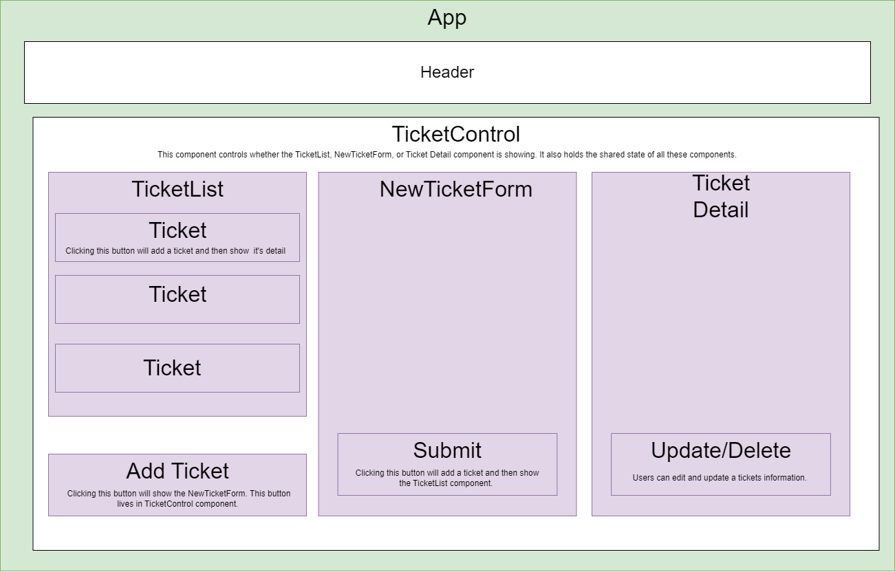

# _Help Queue_

#### By _**Jake Elsberry**_

#### _A react app for managing tickets to track software bugs  and assigning people to fix them._

## Technologies Used

* _React.js_
* _Node.js_
* _NodePackageManager(NPM)_
* _Javascipt_
* _Html_
* _CSS_

## Description

_This react application is for tracking bugs that can arise in a software application. Information can be added, edited, and deleted(CRUD)._

## Setup/Installation Requirements

1.  _Clone project from [Github repository](https://github.com/Schmelzberry/TicketManagerReact.git)_

2. _Navigate to the root project directory_

3.  _ From root directory, run the node server with bash command: $ npm start_

## Component Diagram

## Known Bugs

* Delete item function missing
* Format items on page

## License

_MIT_

Copyright (c) _9/10/2023_ _Jake Elsberry_